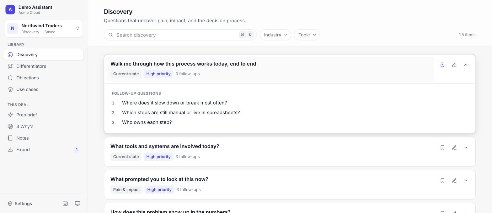

# SE Demo Assistant

A demo-day copilot for Solutions Engineers. Discovery questions, competitive positioning, and objection handling in one searchable library, plus a per-prospect workspace for notes, the 3 Why's, an AI pre-call brief, a live objection copilot, and one-click PDF/Word exports.

Product-agnostic: set your product name and pitch in **Settings** and the library, exports, and AI prompts all use them.



## Features

### Library
- **Discovery** — 15 questions with follow-ups covering current state, pain and impact, users, the decision process, and technical fit. Filter by industry and topic.
- **Differentiators** — positioning against the alternatives every deal faces: the status quo, building in-house, the incumbent vendor, and point solutions.
- **Objections** — 12 common objections with a response, talking points, and questions to ask back.
- **Use cases** — 8 business outcomes to anchor a demo, each with a structured per-deal documentation panel (context, stakeholders, timeline, requirements).
- **Search** across every view (`⌘K` or `/`).

### Deal workspace
- **Sessions** — one per prospect, with deal stage, industry, and meeting date. Everything **auto-saves** to the browser; sessions can be downloaded and imported as JSON.
- **Notes** — meeting notes plus notes pinned to any library card.
- **3 Why's** — why change, why now, why us.
- **Prep brief** — paste a company, website, and stakeholder profiles to stream a personalised brief from Claude (with web search): company context, tailored discovery, talking points, and a demo flow.
- **Objection copilot** — paste what the prospect just said to get the read, a response to say out loud, and questions to redirect. Matching library cards are highlighted.
- **Export** — a polished PDF or editable Word document with the session's 3 Why's, notes, and the cards you saved.

### Quality of life
- Light and dark themes (or follow the system), six accent colours
- Keyboard shortcuts for everything (`?` to see them)
- Responsive layout with a collapsible sidebar on small screens
- Error boundaries, accessible dialogs with focus management, and reduced-motion support

## Quick start

```bash
git clone https://github.com/AhsonJalali/se-demo-assistant.git
cd se-demo-assistant
npm install
npm run dev          # http://localhost:5173
```

Open **Settings** and enter your product name (and optionally a short pitch, which the AI features use for context).

The library works with no configuration. For the AI features locally, copy `.env.example` to `.env` and set `VITE_ANTHROPIC_API_KEY`. The Vite dev proxy forwards requests to the Anthropic API, and the key stays on your machine.

## Making it yours

The content lives in `src/data/*.json`. Refer to your product as `{{product}}` (or `{{Product}}` at the start of a sentence) and to your company as `{{company}}`; the values from Settings are filled in at runtime.

| File | What it holds |
| --- | --- |
| `discovery.json` | Discovery questions and follow-ups |
| `differentiators.json` | Positioning, grouped by alternative (`ours` / `theirs` / talking points / demo tip) |
| `objections.json` | Objections, responses, talking points, questions to ask back |
| `usecases.json` | Use cases with benefits, challenges, and demo scenarios |
| `threeWhys.json` | The 3 Why's prompts |
| `categories.json` | Industries, alternatives, and category labels used by filters |

Swap in your own competitors, industries, and objections and the filters, exports, and AI prompts follow automatically.

## Deploying (Vercel)

The repo includes serverless functions so the deployed app never exposes secrets to the browser:

| Env var | Required | Purpose |
| --- | --- | --- |
| `ANTHROPIC_API_KEY` | for AI features | Read server-side by `api/anthropic/messages.js` (Edge function proxy). Do **not** set `VITE_ANTHROPIC_API_KEY` in production — it would be bundled into public JS. |
| `APP_USERNAME` / `APP_PASSWORD` / `APP_SECRET` | optional | Enables the login gate (`api/auth.js`, HMAC-signed tokens). Unset = app is open. |
| `RATE_LIMIT_MAX` / `RATE_LIMIT_WINDOW_MINUTES` | optional | Best-effort per-IP rate limiting on AI requests (default 20/hour). |

Any static host works if you don't need the AI features or the login gate.

## Architecture

- **React 18 + Vite 6 + Tailwind 3.** Design tokens are CSS variables (`src/index.css`) mapped into Tailwind (`tailwind.config.js`), so themes and accents are a single attribute on `<html>`.
- **State** in one context (`src/context/AppContext.jsx`); workspace settings in `src/config/workspace.js`; navigation in `src/config/views.js`.
- **Persistence** in `localStorage` (`src/utils/storageManager.js`), with debounced auto-save and a flush on tab close.
- **AI streaming** with native `fetch` + `ReadableStream`, no SDK (`src/utils/claudeApi.js`).
- **Exports** (`jsPDF`, `docx`) are code-split and load on demand.
- **Vercel Edge functions** (`api/`) for the Anthropic proxy, auth, and rate limiting.

## Roadmap

See [ROADMAP.md](ROADMAP.md).
