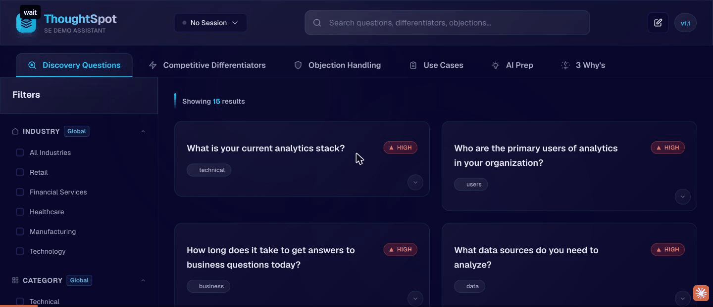

# ThoughtSpot SE Demo Assistant

A demo-day copilot for Solutions Engineers: curated discovery questions, competitive differentiators, and objection handling in one searchable UI — plus per-prospect sessions with notes, a Claude-powered pre-call prep brief, and one-click PDF/DOCX leave-behinds.

Built by a ThoughtSpot SE for personal use. **Not an official ThoughtSpot product** — all content is general sales-engineering knowledge, editable JSON you can adapt to any product.



## Features

### Content library
- **Discovery Questions** — 15 categorized questions with follow-ups, prioritized and filterable by industry and category
- **Competitive Differentiators** — 21 feature-by-feature comparisons vs Tableau, Power BI, Looker, and Qlik, each with talking points and a demo tip
- **Objection Handling** — 12 common objections with responses, talking points, and redirect questions
- **Use Cases** — 8 use-case briefs (analytics modernization, embedded analytics, self-service BI, …)
- **Global search + filters** across everything, live as you type

### Session workflow
- **Sessions** — create a session per prospect (deal stage, industry, use cases); everything you select and write is scoped to it and persisted in `localStorage`
- **Notes** — attach notes to any card, plus general session notes
- **3 Why's** — capture *Why Change / Why Now / Why ThoughtSpot* answers per session with guided prompts
- **Use-case documentation** — structured write-ups of the prospect's use cases as you discover them
- **Export** — generate a PDF or DOCX leave-behind from the session (jsPDF / docx)

### AI Prep
Paste a company name, website, and LinkedIn profile text — get a streaming, personalized pre-call brief from Claude: prospect summary, targeted discovery questions, talking points, and a suggested demo flow, grounded in the app's own content library.


## Quick start

```bash
git clone https://github.com/AhsonJalali/se-demo-assistant.git
cd se-demo-assistant
npm install
npm run dev          # http://localhost:5173
```

The content tabs work with zero configuration. For the **AI Prep** tab locally, copy `.env.example` to `.env` and set `VITE_ANTHROPIC_API_KEY` (the Vite dev proxy forwards requests to the Anthropic API; the key never leaves your machine in dev).

## Deploying (Vercel)

The repo ships with serverless functions so the deployed app never exposes secrets to the browser:

| Env var | Required | Purpose |
| --- | --- | --- |
| `ANTHROPIC_API_KEY` | for AI Prep | Read server-side by `api/anthropic/messages.js` (Edge function proxy). Do **not** set `VITE_ANTHROPIC_API_KEY` in prod — it would be bundled into public JS. |
| `APP_USERNAME` / `APP_PASSWORD` / `APP_SECRET` | optional | Enables the login gate (`api/auth.js`, HMAC-signed tokens). Unset = app is open. |
| `RATE_LIMIT_MAX` / `RATE_LIMIT_WINDOW_MINUTES` | optional | Best-effort per-IP rate limiting on AI queries (default 20/hour). |

Push to Vercel, set the env vars, done. Any static host works if you don't need AI Prep or auth.

## Editing content

All content lives in `src/data/*.json` — `discovery.json`, `differentiators.json`, `objections.json`, `usecases.json`, `threeWhys.json`, `categories.json`. Edit and the dev server hot-reloads. Example discovery question:

```json
{
  "id": "disc-16",
  "question": "Your question here?",
  "category": "technical",
  "industries": ["retail", "finance"],
  "priority": "high",
  "followUp": ["Follow-up question 1?"]
}
```

Swap the JSON and the branding and this works as a demo assistant for any product.

## Architecture

- **React 18 + Vite 6 + Tailwind**, global state via Context (`src/context/AppContext.jsx`)
- **No backend** for the core app — sessions persist in `localStorage` (`src/utils/storageManager.js`)
- **AI streaming** with native `fetch` + `ReadableStream`, no SDK; output parsed into sections by markers
- **Vercel Edge functions** (`api/`) for the Anthropic proxy, auth, and rate limiting
- Design docs for each feature live in [`docs/plans/`](docs/plans/)

## Roadmap

See [ROADMAP.md](ROADMAP.md) — highlights: an objection-handling copilot, post-demo recap generation from session notes, more competitor packs, session sharing, and a test suite.

## Disclaimer

ThoughtSpot is a trademark of ThoughtSpot, Inc. This is a personal project and is not affiliated with or endorsed by ThoughtSpot. No license granted yet — open an issue if you'd like to use this.
